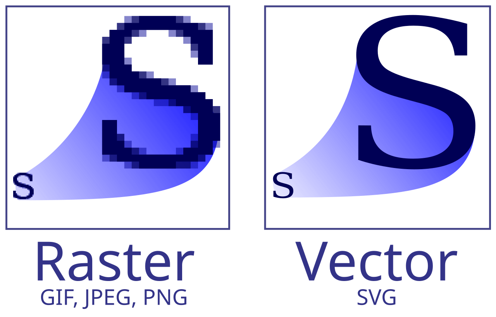

# What is SVG?
Navigation:
 - [Home](README.md)
 - [How to create a SVG](basics_howTo.md)

**Scalable Vector Graphic (SVG)** is an XML-based vector image format.

- What is a **Vector Image**?

Vector is the key word here. A vector graphic is an image that can scale without losing the quality of the image. 

Common pictures or images you see on devices with screens will normally be made with a **raster** image, which are images that use pixels to create an image your brain can recognize.

In the image above, the left side shows an image that uses Raster graphics while the right side is an image that uses vector graphics.

When you try to scale **raster** images, it can lose its sharpness or its detail depending on if you increase or decrease the size of the image.

With vector graphics, you can increase and decrease the size of the image without losing the quality of the intended design. That is because vector graphics uses a series of math formulas to draw its shape and colors.

<svg width="250" height="250">
    <circle cx="75" cy="75" r="75"
        fill="Red"
        stroke="black"
        strock-width="3" />
</svg>

This red circle above is an example of a vector image made with just a series of code.

-----
## "*Should I know anything before I start*"

For this tutorial, its good if you at least know HTML. But this will give a straight forward guide on how to make a SVG image from start to finish.

## "*When can we start?*"

Click the link below to start designing a SVG image!

[Start making a SVG!](basics_howTo.md)
